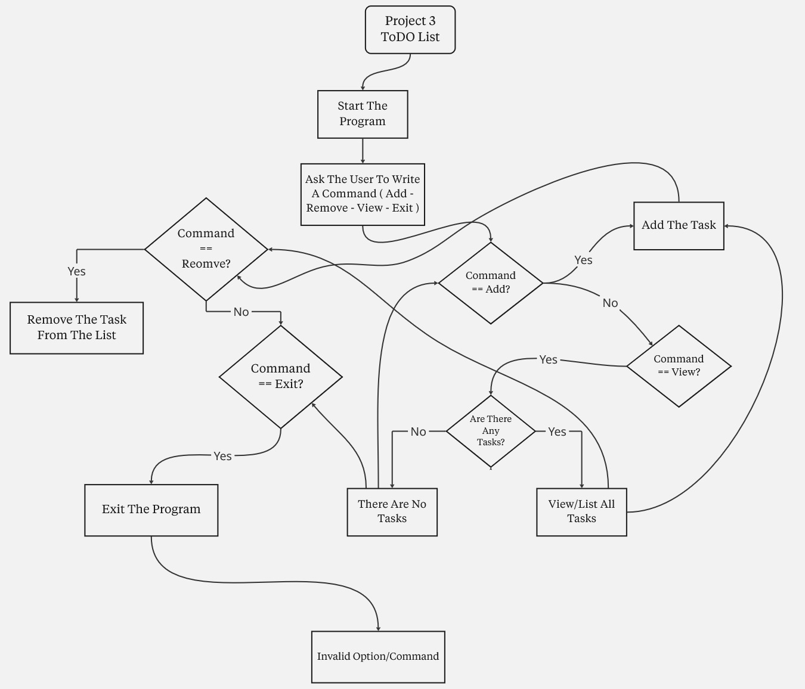
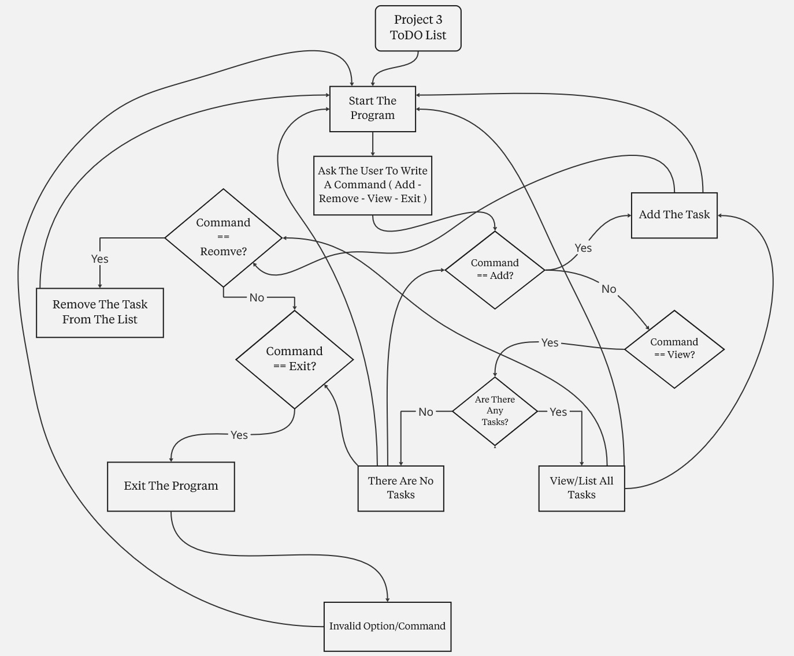
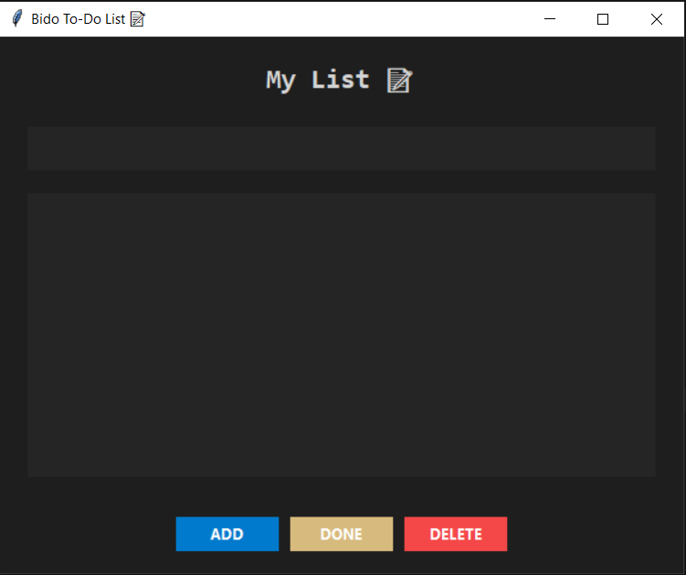
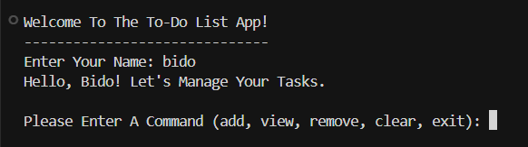
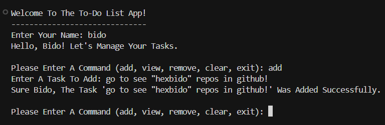
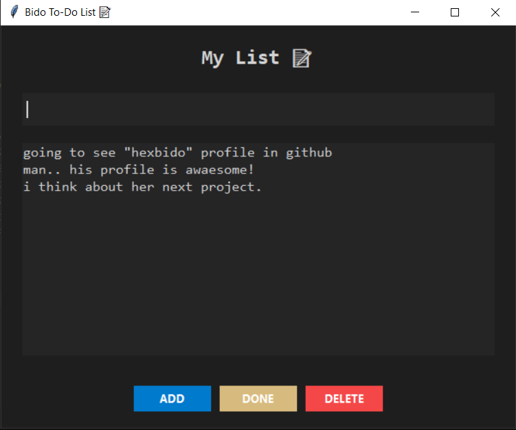
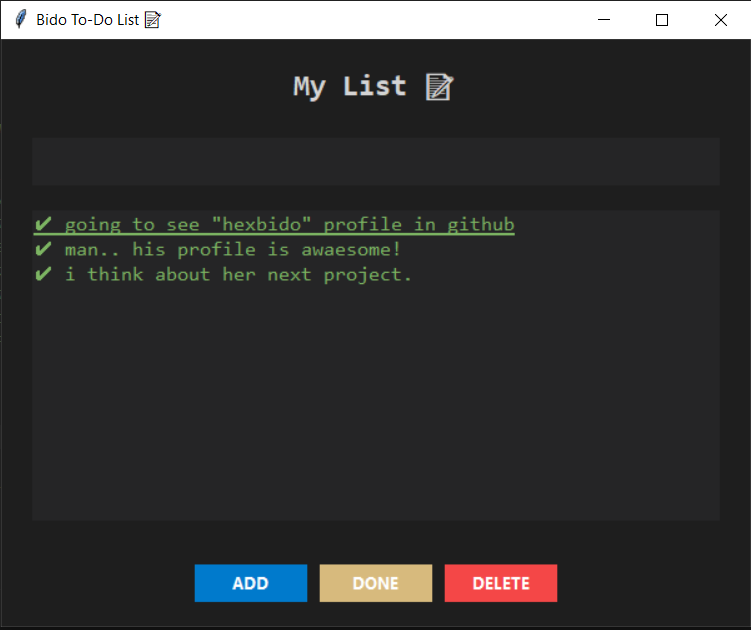
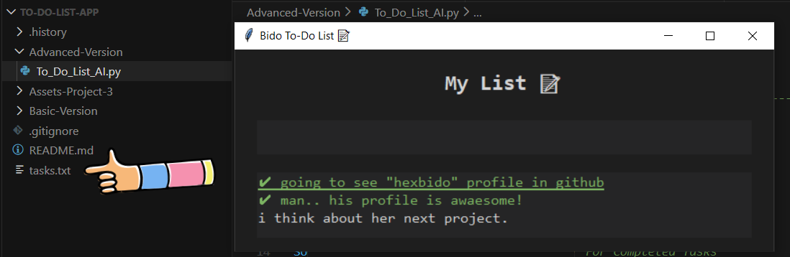
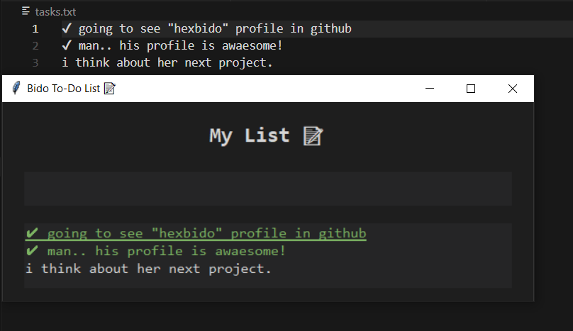

<div align="center">
  

<div align="center">
  
  <h1>Python To-Do List App </h1>
  
  <p>
    <i>A Comprehensive Task Management Solution: From Basic <strong>Console Commands</strong> To Advanced <strong>GUI Interface</strong>, Persistent Storage, And Professional Dark Theme Design.</i>
  </p>

  <p>
    <a href="#-about-the-project">About</a> •
    <a href="#-tech-stack--tools">Tech Stack</a> •
    <a href="#-gallery--demo">Gallery</a> •
    <a href="#-features--evolution">Evolution</a> •
    <a href="#-installation--usage">How To Run</a> •
    <a href="#-warnings--troubleshooting">Warnings</a>
  </p>
</div>

<br>

<br>

<h2 align="center" id="-about-the-project">About The Project </h2>

<div align="center">
  <p>
    <i>This Repository Represents The <strong>Third Major Milestone</strong> In My <strong>Front-End Diploma (Programming Fundamentals Track)</strong>.</i>
  </p>
  <p>
    <i>It's More Than Just An App, It's A Documentation Of My Journey In <strong>Application Development & User Interface Design</strong>. The Project Chronicles The Evolution From Simple Terminal-Based Task Management Using <strong>Console Input/Output</strong> To A Sophisticated Desktop Application Powered By <strong>Tkinter GUI Framework</strong>.</i>
  </p>
  <p>
    <i>The Final Version Is An Intelligent Tool That Provides A Modern Visual Interface For Task Management, Implements <strong>Persistent File Storage</strong> For Data Retention, Features A Professional <strong>Dark Theme UI</strong> With Color-Coded Task Status, And Includes Smart <strong>Keyboard Shortcuts</strong> For Enhanced Productivity.</i>
  </p>
</div>

<br>

<br>

<h2 align="center" id="-tech-stack--tools">Tech Stack & Tools </h2>

<div align="center">
  
  
  
  
  
</div>

<br>

<div align="center">
  <p>
    • <strong>Python (3.10+):</strong> <i>The Core Language Driving All Application Logic, Data Processing, And Event Handling Operations.</i><br>
    • <strong>Tkinter GUI Framework:</strong> <i>Powers The Complete Visual Interface With Widgets, Event Bindings, And Professional Window Management.</i><br>
    • <strong>OS Module:</strong> <i>Utilized For Cross-Platform Screen Clearing And File System Operations To Ensure Compatibility Across Operating Systems.</i><br>
    • <strong>File I/O Operations:</strong> <i>Implements Persistent Storage Using Text Files With UTF-8 Encoding For Reliable Task Data Management.</i><br>
    • <strong>Tkinter Messagebox:</strong> <i>Provides User-Friendly Dialog Boxes For Warnings, Information Messages, And Input Validation Feedback.</i><br>
    • <strong>Miro:</strong> <i>Used For Planning And Designing The Application Flow And UI Layout Before Writing Any Code.</i>
  </p>
</div>

<br>

<br>

<h2 align="center" id="-gallery--demo">Gallery & Demo </h2>

<div align="center">
  <i>The Project Followed A Structured "Plan-Then-Code" Approach - Below Is The Comparison Between The Planning Phase And The Final Execution For Both Versions.</i>
</div>
<br>

<table align="center" width="100%">
  <tr>
    <th style="text-align: center;" width="50%">Basic Version</th>
    <th style="text-align: center;" width="50%">Advanced Version</th>
  </tr>
  
  <tr>
    <td align="center">
      <strong>Planning (Logic)</strong><br><br>
      
    </td>
    <td align="center">
      <strong>Planning (Logic)</strong><br><br>
      
    </td>
  </tr>

  <tr>
    <td align="center" valign="top">
      <strong>Execution (Main Result)</strong><br><br>
      
    </td>
    <td align="center" valign="top">
      <strong>Execution (Main Result)</strong><br><br>
      
    </td>
  </tr>
</table>

<br>

<div align="center">
<details>
  <summary style="font-size: 1.2em; font-weight: bold; cursor: pointer;">View More Screenshots (Click Here) </summary>
  <br>
  
  <h3>Basic Version - Extra Shots</h3>
  <table align="center" width="100%">
    <tr>
      <td align="center" valign="middle" width="50%">
        
      </td>
      <td align="center" valign="middle" width="50%">
        
      </td>
    </tr>
  </table>
  
  <br><br><hr><br>
  
  <h3>Advanced Version - Extra Shots</h3>
  <table align="center" width="100%">
    <tr>
      <td align="center" valign="middle" width="50%">
        
      </td>
      <td align="center" valign="middle" width="50%">
        
      </td>
    </tr>
  </table>
  
  <br>
  
  <table align="center" width="100%">
    <tr>
      <td align="center" valign="middle" width="50%">
        
      </td>
      <td align="center" valign="middle" width="50%">
        
      </td>
    </tr>
  </table>
  
</details>
</div>

<br>

<div align="center">
  <h3>Live Demo </h3>
  <p><i>Watch The Application In Action: Creating, Managing, And Persisting Tasks With The GUI Interface.</i></p>
  
  <a href="https://drive.google.com/file/d/1qgzfWDXa5TGWifz9Mk_Oca6c-ofeN8Pi/view?usp=sharing" target="_blank">
    
    <br>
    <em>Click To Watch Video ▷</em>
  </a>
</div>

<br>

<br>

<h2 align="center" id="-features--evolution">Features & Evolution </h2>

<div align="center">
<i>The Transition From The Basic Console Application To The Advanced GUI Tool Highlights A Significant Leap In User Experience And Feature Richness.</i>
</div>
<br>

<table align="center" style="border-collapse: collapse; width: 85%;">
  <thead>
    <tr>
      <th align="center" style="border: 1px solid #ddd; padding: 12px; text-align: center;"><strong>Feature</strong></th>
      <th align="center" style="border: 1px solid #ddd; padding: 12px; text-align: center;"><strong>Basic Version</strong></th>
      <th align="center" style="border: 1px solid #ddd; padding: 12px; text-align: center;"><strong>Advanced Version (GUI)</strong></th>
    </tr>
  </thead>
  <tbody>
    <tr>
      <td align="center" style="border: 1px solid #ddd; padding: 10px;"><strong>Interface Type</strong></td>
      <td align="center" style="border: 1px solid #ddd; padding: 10px;">Console/Terminal Based</td>
      <td align="center" style="border: 1px solid #ddd; padding: 10px;"><strong>Graphical User Interface</strong> (Tkinter)</td>
    </tr>
    <tr>
      <td align="center" style="border: 1px solid #ddd; padding: 10px;"><strong>Data Persistence</strong></td>
      <td align="center" style="border: 1px solid #ddd; padding: 10px;">Session Only (Lost On Exit)</td>
      <td align="center" style="border: 1px solid #ddd; padding: 10px;"><strong>File Storage</strong> (tasks.txt)</td>
    </tr>
    <tr>
      <td align="center" style="border: 1px solid #ddd; padding: 10px;"><strong>User Experience</strong></td>
      <td align="center" style="border: 1px solid #ddd; padding: 10px;">Text Commands & Manual Input</td>
      <td align="center" style="border: 1px solid #ddd; padding: 10px;"><strong>Click & Type</strong> With Visual Feedback</td>
    </tr>
    <tr>
      <td align="center" style="border: 1px solid #ddd; padding: 10px;"><strong>Task Status</strong></td>
      <td align="center" style="border: 1px solid #ddd; padding: 10px;">Plain Text Display</td>
      <td align="center" style="border: 1px solid #ddd; padding: 10px;"><strong>Color-Coded Status</strong> (Green For Done)</td>
    </tr>
    <tr>
      <td align="center" style="border: 1px solid #ddd; padding: 10px;"><strong>Input Method</strong></td>
      <td align="center" style="border: 1px solid #ddd; padding: 10px;">Command-Based Navigation</td>
      <td align="center" style="border: 1px solid #ddd; padding: 10px;"><strong>Keyboard Shortcuts</strong> & Buttons</td>
    </tr>
    <tr>
      <td align="center" style="border: 1px solid #ddd; padding: 10px;"><strong>Visual Design</strong></td>
      <td align="center" style="border: 1px solid #ddd; padding: 10px;">Default Console Colors</td>
      <td align="center" style="border: 1px solid #ddd; padding: 10px;"><strong>Professional Dark Theme</strong></td>
    </tr>
  </tbody>
</table>

<br>

<div align="center">
  <h3>Key Features In Advanced Version </h3>
  <p>
    • <i><strong>Modern GUI Framework:</strong> Built Using <strong>Tkinter</strong> With Custom Styling, Providing A Professional And Intuitive Desktop Application Experience.</i><br>
    • <i><strong>Persistent Storage System:</strong> Automatically Saves All Tasks To <strong>tasks.txt</strong> File Using UTF-8 Encoding, Ensuring Data Survival Across Multiple Sessions.</i><br>
    • <i><strong>Visual Task Status:</strong> Implements A Smart Toggle System That Marks Completed Tasks With A Checkmark (✓) And Changes Their Color To Green For Easy Identification.</i><br>
    • <i><strong>Keyboard Shortcuts:</strong> Press <strong>Enter</strong> To Add Tasks Instantly And <strong>Delete</strong> Key To Remove Selected Items, Boosting Productivity And User Efficiency.</i><br>
    • <i><strong>Centered Window Positioning:</strong> The Application Window Automatically Centers Itself On Any Screen Resolution, Providing A Consistent User Experience.</i><br>
    • <i><strong>Error Prevention:</strong> Built-In Validation Using Messagebox Dialogs Prevents Users From Adding Empty Tasks Or Deleting Without Selection.</i>
  </p>
</div>

<br>

<br>

<h2 align="center" id="-installation--usage">Installation & Usage </h2>

<div align="center">
  <i>Follow The Steps Below To Run The Project Locally On Your Machine - Ensure You Have <strong>Python 3.10+</strong> Installed.</i>
</div>

<br>

<div align="center">
  <h3>1️⃣ Clone The Repository</h3>
  <i>Open Your Terminal And Run The Following Command To Download The Project Files:</i>
</div>

```bash
git clone https://github.com/hexbido/To-Do-List-App.git
cd To-Do-List-App
```

<br>

<div align="center">
  <h3>2️⃣ No External Dependencies Required</h3>
  <i>This Project Uses Only Python's Built-In Libraries (tkinter, os). No Additional Packages Need To Be Installed!</i>
</div>

<br>

<div align="center">
  <h3>3️⃣ Run The Basic Version</h3>
  <i>Navigate To The Basic Version Folder And Execute The Console-Based Script:</i> 
</div>

```bash
cd Basic-Version
python To_Do_List.py
```

<br>

<div align="center">
  <h3>4️⃣ Run The Advanced Version (GUI)</h3>
  <i>To Launch The Full Graphical Interface With Persistent Storage:</i> 
</div>

```bash
cd Advanced-Version
python To_Do_List_AI.py
```

<br>

<div align="center">
  <h3>5️⃣ Using The Application</h3>
  <i>Follow These Simple Steps To Manage Your Tasks Efficiently:</i>
</div>

<div align="center">
  <p>
    • <strong>Adding Tasks:</strong> <i>Type Your Task In The Input Field And Press <strong>Enter</strong> Or Click The <strong>ADD</strong> Button.</i><br>
    • <strong>Marking As Done:</strong> <i>Select A Task From The List And Click The <strong>DONE</strong> Button To Toggle Its Status.</i><br>
    • <strong>Deleting Tasks:</strong> <i>Select A Task And Press The <strong>Delete</strong> Key Or Click The <strong>DELETE</strong> Button.</i><br>
    • <strong>Data Persistence:</strong> <i>All Changes Are Automatically Saved To <strong>tasks.txt</strong> - Your Tasks Will Be Restored On Next Launch.</i>
  </p>
</div>

<br>

<br>

<h2 align="center" id="-warnings--troubleshooting">Warnings & Troubleshooting </h2>

<div align="center">
  <p><i>Please Review The Following Notes To Ensure Smooth Operation And Avoid Common Issues:</i></p>
  
  <p>
    • <strong>Tkinter Installation:</strong> <i>Tkinter Comes Pre-Installed With Python On Most Systems. However, On Linux You May Need To Install It Separately Using: <code>sudo apt-get install python3-tk</code></i><br><br>
    • <strong>File Permissions:</strong> <i>Ensure The Application Has Write Permissions In Its Directory To Create And Modify The <strong>tasks.txt</strong> File For Data Persistence.</i><br><br>
    • <strong>Character Encoding:</strong> <i>The Application Uses UTF-8 Encoding To Support International Characters And Emojis - Ensure Your System Supports UTF-8 File Operations.</i><br><br>
    • <strong>Screen Resolution:</strong> <i>The Window Is Designed For Standard Desktop Resolutions (1920x1080 And Above) - On Smaller Screens, Some UI Elements May Appear Truncated.</i><br><br>
    • <strong>Task File Location:</strong> <i>The <strong>tasks.txt</strong> File Is Created In The Same Directory As The Script - Do Not Delete This File Unless You Want To Reset All Tasks.</i><br><br>
    • <strong>Keyboard Shortcuts:</strong> <i>The <strong>Enter</strong> And <strong>Delete</strong> Keys Are Bound To Specific Functions - These Shortcuts Work Only When The Application Window Is Focused.</i><br><br>
    • <strong>Running Multiple Instances:</strong> <i>Opening Multiple Instances Of The Advanced Version May Cause Data Conflicts - It's Recommended To Run Only One Instance At A Time.</i>
  </p>
</div>

<br>

<div align="center">
  <p><i>Made With  By <a href="https://github.com/hexbido">B I D O</a></i></p>
</div>

